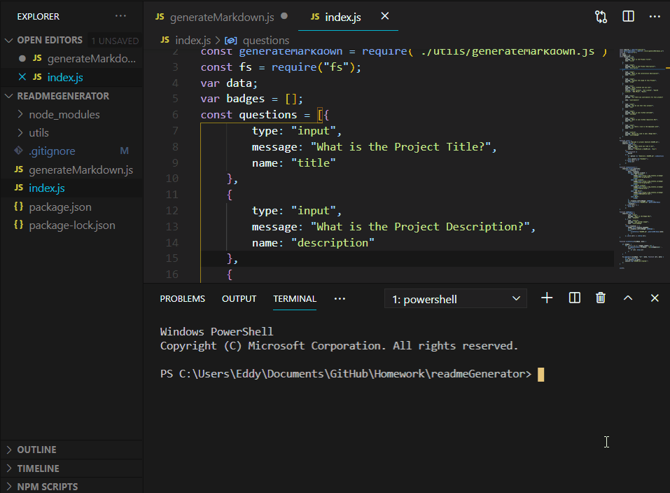

 

# README Generator

### Table of Contents
- [Description](#description)
- [Installation](#installation)
- [Usage](#usage)
- [License](#license)
- [Contributors](#contributors)
- [Test](#test)
- [Questions](#questions)

## Description
This project will generate a README file through the command line. The readme template includes anchor tags that jump to sections of the file, and includes a recursive feature that allows the user to enter as many badges as they would like that will appear on the top of the page. 

## Installation
Simply clone this repository and run 
```
npm install
```

## Usage
This is used to quicky generate a thorough README with a table of contents that are anchored to each section of the page/

## License
This project uses ICS License.

## Contributors
None.

## Test
After installion run in the respective directory
```
node index.js
```

## Questions

GitHub: [eddyangang](https://github.com/eddyangang)

Deployed Site: [here](https://github.com/eddyangang)

## Preview


